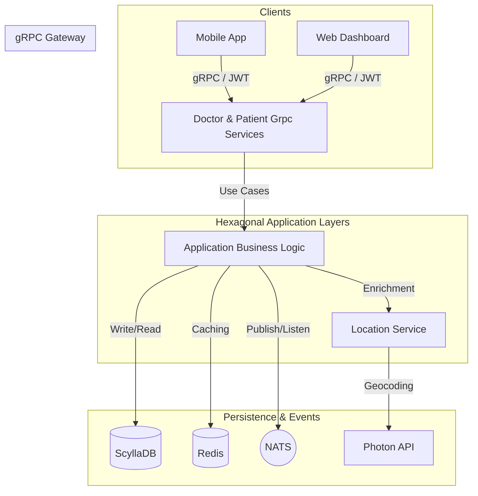

# Health Service (gRPC + Micronaut + ScyllaDB)

A high-performance, distributed Healthcare Management System built with **Micronaut**, **gRPC**, and **ScyllaDB**. The system provides real-time doctor discovery, clinic management, and appointment scheduling with high availability and geographic proximity features.

## 🏛️ System Overview



---

## 🏗️ Architecture & Design
The project follows **Hexagonal Architecture (Ports and Adapters)** and **Domain-Driven Design (DDD)** principles to ensure high maintainability and testability:
- **Domain Layer**: Contains business models (Doctor, Patient, Appointment), logic, and port interfaces.
- **Application Layer**: Orchestrates use cases (Booking, Discovery, Auth) and coordinates between domain and infrastructure.
- **Adapters Layer**: 
    - **Input (Driving)**: gRPC Services, NATS Listeners (reacting to events).
    - **Output (Driven)**: ScyllaDB Repositories, Photon API Client, NATS Clients, Redis Caching.

---

## 🚀 Key Features

### 👨‍⚕️ Doctor & Clinic Management
- **Geographic Discovery**: Nearby doctor search using multi-precision Geohashes (4 to 6).
- **Availability Logic**: Real-time "Available Today" status vs. "Next Possible Date" calculations.
- **Bulk Optimization**: Efficient data retrieval using `IN` clause batching for high-performance discovery.

### 📅 Advanced Appointment System
- **Slot Alignment**: Enforces strict booking intervals based on doctor-defined `slotDurationMinutes`.
- **Capacity Management**: Automatic rejection of bookings exceeding `maxAppointmentsPerDay`.
- **Conflict Prevention**: Native double-booking prevention at the data layer using atomic checks.

### 🌍 Location Intelligence
- **Photon Geocoding**: Resolves natural language addresses (e.g., "Kathmandu") into high-precision coordinates.
- **Proximity Sorting**: Haversine formula implementation for accurate distance-based sorting in kilometers.

### ⚡ Performance & Scalability
- **Event-Driven**: NATS messaging for asynchronous updates and decoupling between Doctor and Patient modules.
- **Cache-Aside Pattern**: Redis-backed caching for doctor profiles (1h TTL) and location-based searches (10m TTL).

---

## 📡 NATS Event Ecosystem
NATS is used to decouple the system by broadcasting state changes asynchronously:
- **Subjects**: `doctor.*`, `patient.*`, `appointment.*`.
- **Workflow**:
    1. Doctor accepts an appointment via gRPC.
    2. System updates ScyllaDB.
    3. `appointment.accepted` is broadcast via NATS.
    4. Interested modules (like `patient-module`) log the event or trigger notifications.

---

## 🔐 Security & Authentication
- **Initial Login**: Uses **gRPC Basic Auth metadata** (`Authorization: Basic base64(email:password)`).
- **Session Auth**: Uses **JWT Bearer Tokens** (`Authorization: Bearer <token>`).
- **Password Reset**:
    - `ForgotPassword`: Public RPC, generates a **15-minute reset token**.
    - `ResetPassword`: **Authenticated** RPC requiring the reset token in the Bearer header for high security.

---

## 📦 Project Structure
- `common`: Shared Proto definitions, security utilities, and shared models.
- `doctor-module`: Core logic for doctors, clinics, schedules, and geographic search.
- `patient-module`: Patient profiles and appointment history.
- `src/main`: Application entry point and global configuration.

---

## ⚙️ Local Development Setup

### Prerequisites
- **JDK 17+**
- **Docker & Compose** (For ScyllaDB, NATS, and Redis)

### Running Services
```bash
# Start infrastructure
docker compose up -d

# Run application
./gradlew clean run
```

### Monitoring (Localhost)
- **gRPC Server**: `localhost:50051` (Use Kreya or Postman)
- **NATS Monitoring**: `http://localhost:8223`
    - `/connz`: See connected apps.
    - `/subsz`: See active listeners.
- **Redis Stats**: Access via `redis-cli -p 6380 info`.
