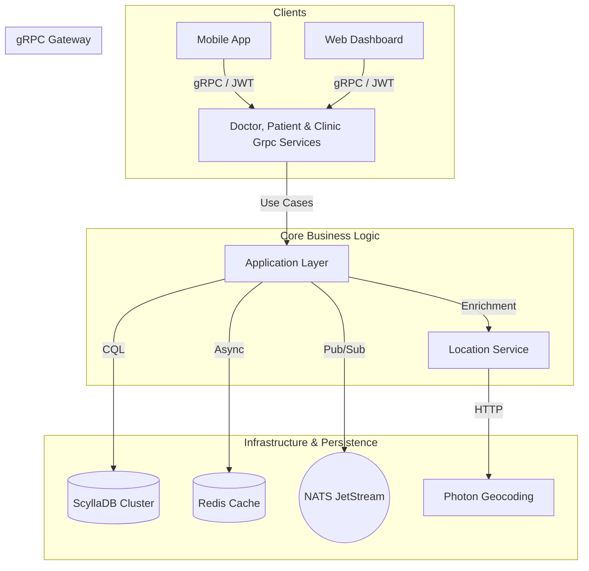

# Health Management System (HMS)

[](https://github.com/your-repo/health-service)
[](https://micronaut.io/)
[](https://grpc.io/)
[](https://www.scylladb.com/)
[](https://redis.io/)
[](https://nats.io/)

A high-performance, distributed Healthcare Management System engineered for scalability and low-latency doctor-patient interactions. Built on a modern **Cloud-Native** stack using **Micronaut**, **gRPC**, and **ScyllaDB**, this system handles real-time doctor discovery, clinic orchestration, and intelligent appointment scheduling.

## 🏛️ System Architecture

The project adheres to **Hexagonal Architecture (Ports and Adapters)** and **Domain-Driven Design (DDD)** principles, ensuring a clean separation of concerns and high testability.



### Module Breakdown
- **`common`**: Shared Protobuf definitions, security utilities (JWT, BCrypt), and cross-cutting concerns (Redis, Validation, DateTime).
- **`doctor-module`**: Manages doctor and clinic profiles, complex schedules, and unified geographic search indices.
- **`patient-module`**: Handles patient lifecycle, appointment history, and profile management.
- **`app`**: Main entry point for the Micronaut application, responsible for DI container initialization and global configuration.

---

## 🚀 Key Features

### 👨‍⚕️ Unified Discovery & Geocoding
- **Smart Search (`GetDoctorsByLocation` / `GetClinicsByLocation`)**: 
    - **Automatic Detection**: Intelligently detects if input is a **Geohash** (direct lookup) or **Location Text** (Photon geocoding).
    - **Priority Matching**: Performs an exact database match on the resolved canonical name before falling back to geohash proximity searching.
    - **Zoom-out Logic**: Automatically expands the search radius using neighbor geohashes to ensure results even in less dense areas.
- **Distance-Aware Ranking**: All results are enriched with precise distance metadata calculated via the **Haversine formula**.

### 🏥 Advanced Clinic & Doctor Management
- **Role-Based Profile Control**: 
    - **Clinic Autonomy**: Dedicated "Clinic" role with authentication allows clinics to manage their own metadata and update affiliated doctor locations.
    - **Dynamic Transitions**: Handles conversion between "Individual Doctor" and "Clinic-Affiliated" status seamlessly, managing all denormalized views automatically.
- **Lifecycle Management**: 
    - **Account Reactivation**: Support for re-registering previously soft-deleted emails, restoring previous profile data instead of rejecting registration.
    - **Hard Delete Integrity**: When a doctor is removed, all associated schedules are permanently (hard) deleted, while appointments are archived.

### 📅 Atomic Scheduling Engine
- **Concurrency Guardrails**: Parallel database checks via `CompletableFuture` in the booking flow reduce latency by up to 60%.
- **Transactional Consistency**: Uses **Logged Batches** in ScyllaDB for synchronized updates across multiple read models (Patient history vs Doctor status views).
- **Guardrail Validation**: Blocks critical actions (like clinic removal or doctor deletion) if there are active `ACCEPTED` or `POSTPONED` appointments.

### ⚡ Optimized Performance Stack
- **Enterprise Redis Implementation**: 
    - **Native String Support**: Efficient raw string storage (avoiding double-quotes) for simple keys.
    - **JSR-310 Ready**: Full support for Java 8 Time types.
    - **Fail-Safe Caching**: Robust null handling and graceful fallback to DB if the cache is unavailable or corrupted.
- **Query Optimization**: 100% usage of **Prepared Statements** and secondary indexing on `location_text` for O(1) lookups of canonical addresses.

---

## 🛠️ Technology Stack

| Component | Technology | Purpose |
| :--- | :--- | :--- |
| **Framework** | Micronaut | Lightweight, AOT-compiled JVM framework |
| **API Protocol** | gRPC | High-performance, type-safe binary communication |
| **Primary DB** | ScyllaDB | Cassandra-compatible, low-latency NoSQL database |
| **Caching** | Redis (Lettuce) | Optimized async caching and distributed locking |
| **Messaging** | NATS | High-speed, lightweight messaging system |
| **Geocoding** | Photon API | High-accuracy address-to-coordinate resolution |
| **Security** | JWT & BCrypt | Token-based auth and secure password hashing |

---

## 🔐 Security & Auth Model
1. **Multi-Role Support**: Distinguishes between **Doctor**, **Patient**, and **Clinic** roles with specific header support (`Authorization_Doctor`, etc.).
2. **Access Control (ACL)**:
    - Doctors can only update their standalone location if they have **no clinic associations**.
    - Clinics can only update location data for doctors **explicitly affiliated** with them.
3. **Intercepted Auth**: Context Propagation (UID, Role) is handled by the `GrpcAuthInterceptor` to prevent unauthorized cross-resource access.

---

## ⚙️ Deployment & Development

### Prerequisites
- **JDK 17+**
- **Docker & Docker Compose**
- **Gradle 8.x**

### Infrastructure Setup
Spin up ScyllaDB, Redis, and NATS:
```bash
docker compose up -d
```

### Running the Application
```bash
./gradlew run
```

---

## 📈 Monitoring
- **NATS Health**: `http://localhost:8222/varz`
- **ScyllaDB**: `nodetool status`
- **Tracing**: Managed via centralized SLF4J logs (debug level configurable in `application.properties`).
